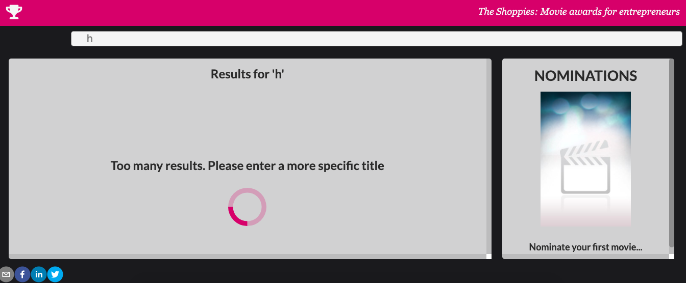
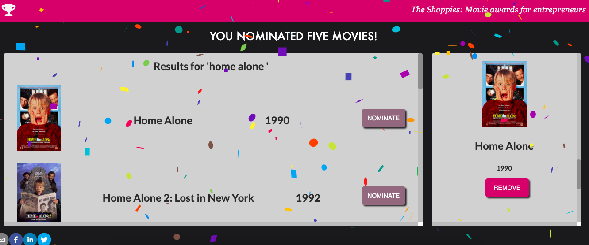
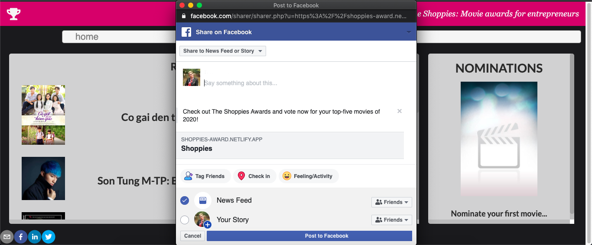

# Movie awards for entrepreneurs

## Description

An app that helps managing movie nominations for the upcoming Shoppies.

[See Demo Here](https://shoppies-award.netlify.app/)

## Getting Started

Clone this repo and cd into the movie-award

- Run `npm install` to install all dependencies
- Run `npm start` to start a server

## Technologies used:

- React.js
- Local Storage
- OMDb API
- Axios

### Search for your favorite movies

### Nominate five favorite movies

### Share with friends

#### Created By _**Margarita Morozova**_
